

  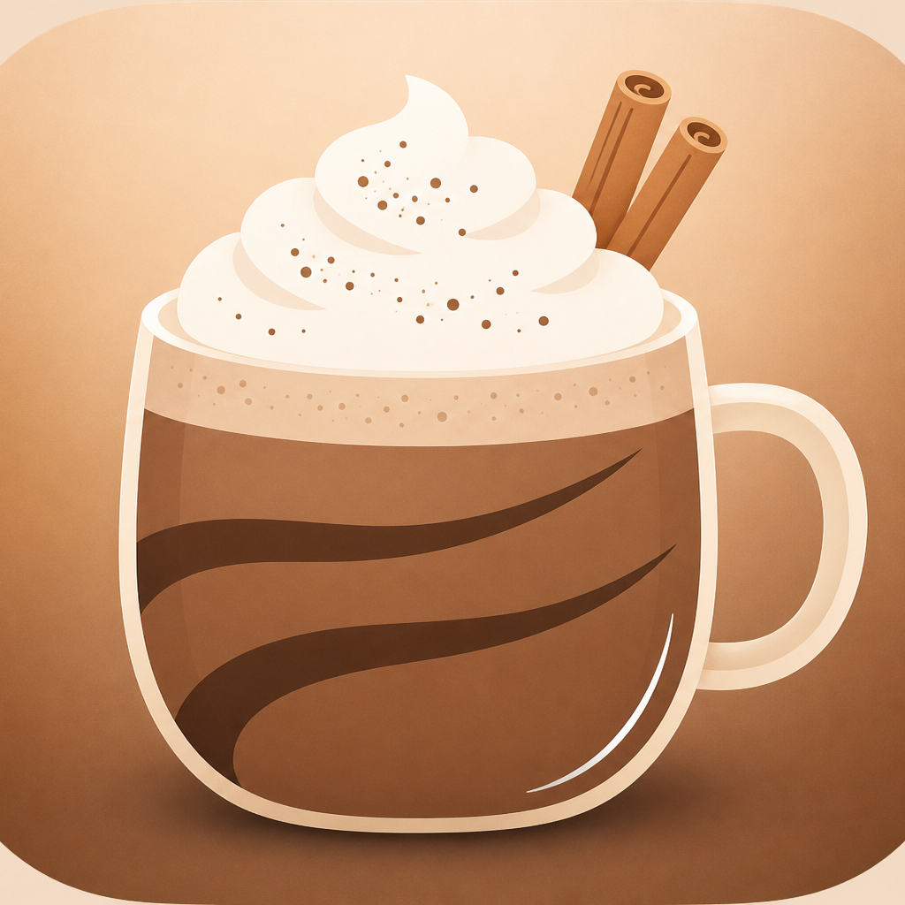

<h1 align="center">Mocka</h1>

  App nativa de Apple para estudiar en iPhone, iPad y Mac. 
  Notas, exámenes, flashcards y enfoque — en un solo lugar, a tu ritmo.

---

### ¿Qué es Mocka?
Mocka es una app de estudio todo-en-uno. Tomas apuntes, dibujas en la pizarra, creas exámenes, repasas con flashcards y llevas sesiones de enfoque sin saltar entre mil herramientas.

La mayoría de apps se quedan en guardar información. Mocka está pensada para un ciclo más cerrado: estudias con *tu* material, ves cómo te va y recibes feedback que puede cambiar lo que practicas después. La dirección hacia la que vamos es simple: la app debería adaptarse a ti. El tiempo que estudias, dónde te trabas y cómo te va deberían influir en lo que Mocka te pide: más exigencia cuando vas bien, y más suave cuando no.

No es otra libreta. Es un sistema de estudio pensado para tu ritmo.

### ¿Para quién es?
Mocka es para estudiantes que toman apuntes de verdad y necesitan convertirlos en práctica.

Eso suele ser preparatoria y universidad — sobre todo en iPad, y también en iPhone o Mac cuando cambias de dispositivo. Si escribes en clase, dibujas diagramas y más tarde necesitas algo mejor que releer la misma página antes del examen, Mocka va dirigida a ti.

---

### Qué puedes hacer
- Capturar el material de clase como notas escritas o trabajo a mano en la pizarra  
- Organizarlo todo por materia  
- Crear exámenes a mano o con IA, y hacerlos en distintos modos  
- Armar flashcards y repasar lo que no se te queda  
- Usar sesiones de enfoque cuando necesitas estudiar sin interrupciones  
- Planear tareas y exámenes próximos en el tablero de estudio  
- Buscar en todo tu material cuando necesitas algo rápido  
- Personalizar cómo se ve la app  
- Volver a entrar desde widgets en la pantalla de inicio  

---

### Funciones, con detalle

#### Notas
Escribe apuntes con formato, mantenlos ordenados por materia y ábrelos después para repasar o practicar. Las notas están pensadas como material vivo de estudio — no como una carpeta que nunca vuelves a abrir.

  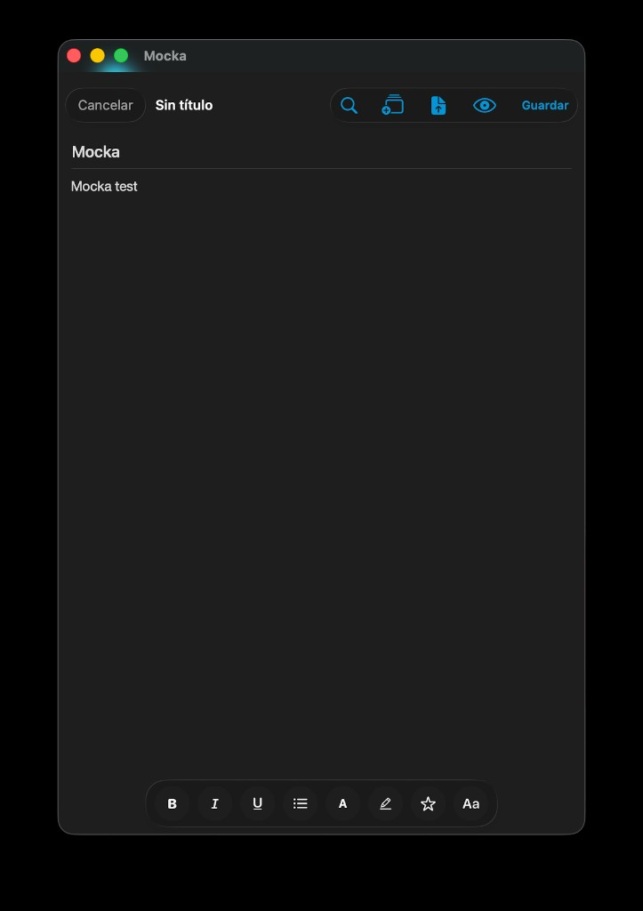

#### Pizarra
Una pizarra infinita para escritura a mano, diagramas y bocetos. Úsala cuando escribir con teclado no alcanza: fórmulas, mapas, figuras rápidas o páginas enteras a mano. El trabajo de la pizarra vive junto a tus notas, así que texto y dibujos siguen el mismo flujo de estudio.

  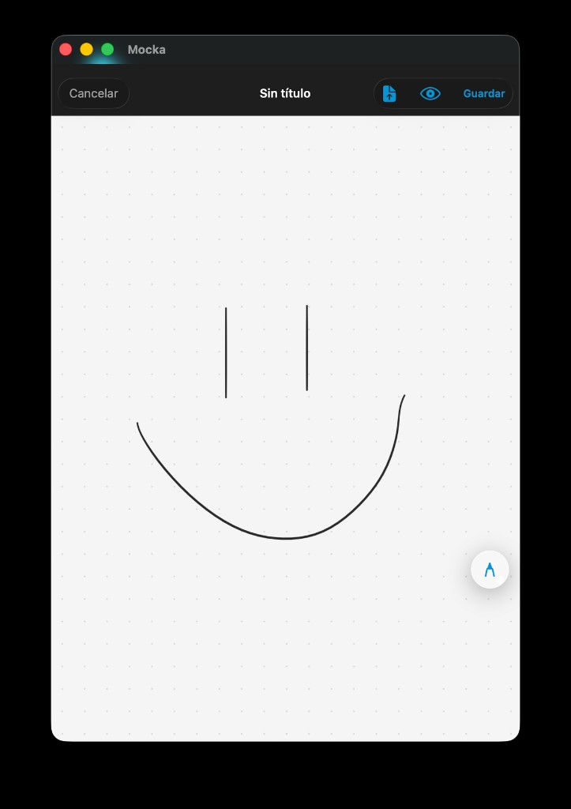

#### Exámenes
Crear y presentar exámenes dentro de Mocka es una parte central de la app, no un extra.

Puedes armar exámenes de dos formas:

- **Sin IA** — escribes el examen tú: título, materia, preguntas, opciones y la respuesta correcta. También puedes pegar un lote de preguntas cuando ya las tienes escritas.  
- **Con IA** — genera un examen a partir de tu propio material: texto pegado, una foto, un PDF o el contenido de una nota. La IA arma preguntas de práctica con *lo que estudiaste*, no con un banco genérico de quizzes.

Cuando el examen está guardado, puedes presentarlo en distintos modos:

- **Estándar** — avanzas las preguntas a tu ritmo  
- **Contrarreloj** — un límite de tiempo total para todo el examen  
- **Blitz** — un temporizador corto por pregunta, con niveles de dificultad que cambian qué tan rápido tienes que responder  

Puedes revisar resultados después de cada intento, volver sobre los errores y guardar el historial para que el progreso no se pierda en un solo intento.

#### Flashcards
Crea mazos y tarjetas para repaso rápido. Agrega tarjetas a mano, sácalas de tus notas o genéralas con IA a partir del contenido. También puedes convertir preguntas de examen en flashcards cuando quieres seguir practicando lo que salió en una prueba.

Durante el repaso, calificas qué tan bien sabías cada tarjeta para que el material difícil regrese antes. También hay un repaso tipo “para hoy” entre mazos, cuando quieres una sola sesión con lo que necesita atención ahora.

  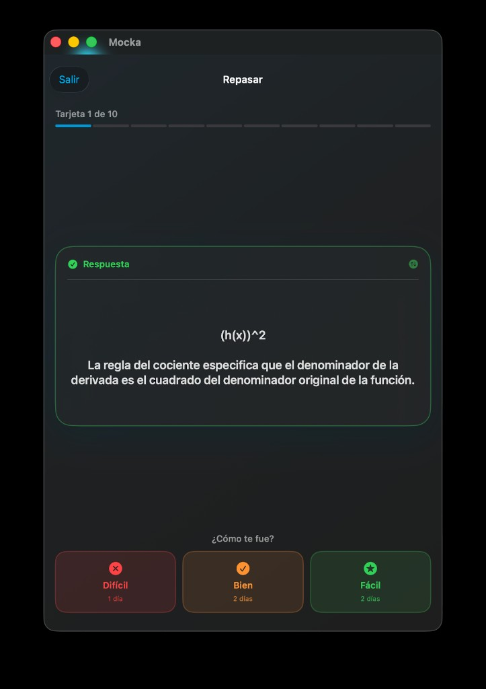

#### Rendimiento y enfoque
Ve racha, exámenes completados y promedios en un solo lugar. Inicia una sesión de enfoque con temporizador cuando necesitas concentrarte: elige la duración, estudia mientras corre el tiempo y mide el progreso frente a una meta diaria.

  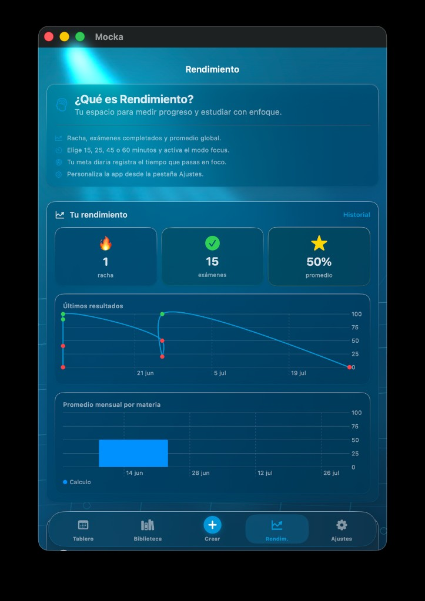

#### Tablero de estudio y tareas
Usa el tablero para ver lo que viene: tareas pendientes y exámenes programados. Crea tareas con materias, prioridades, fechas, checklists y recordatorios para que estudiar no sea solo “abrir la app y esperar”. Las tareas recurrentes están soportadas cuando algo se repite cada día, semana o mes.

  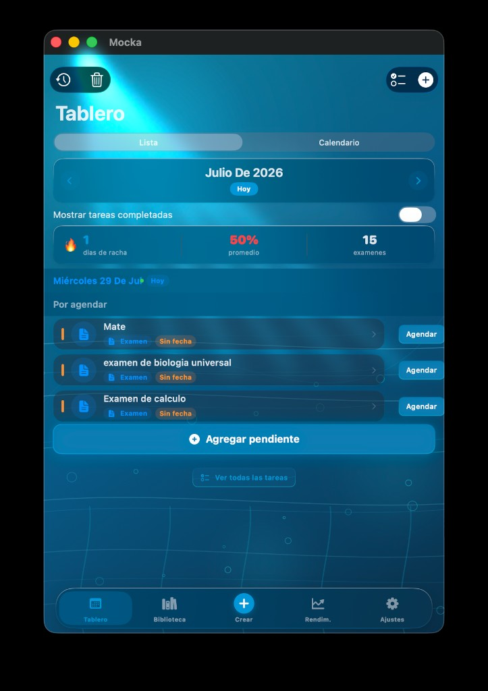

#### Búsqueda
Busca en notas, exámenes y tareas desde un solo lugar. Incluye el texto de las notas y, cuando está disponible, el texto reconocido de la escritura a mano en la pizarra — así algo que dibujaste o escribiste a mano también se puede encontrar después.

#### Biblioteca y materias
Mantén exámenes, notas y flashcards organizados por materia en lugar de una lista interminable. Mueve material entre materias cuando cambien tus clases y mantén la biblioteca legible cuando el semestre se llene.

  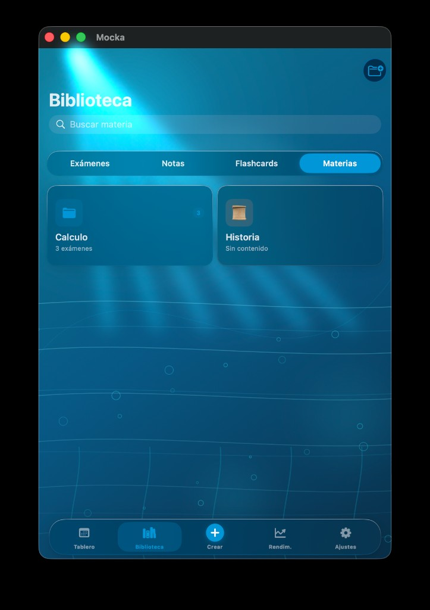

#### Personalización
Cambia el aspecto de la app con distintos temas y preferencias visuales. Mocka debería sentirse como *tu* espacio de estudio, no como una plantilla genérica que apenas toleras.

  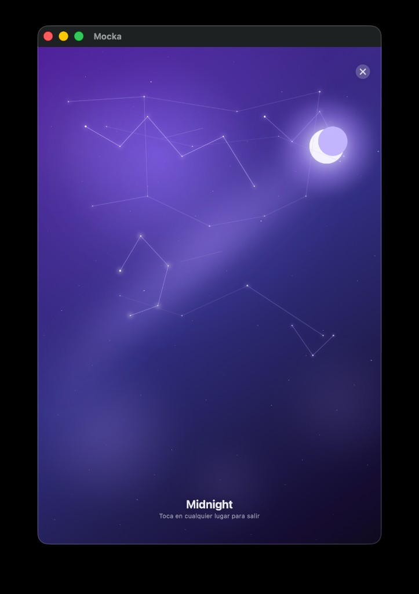
  &nbsp;
  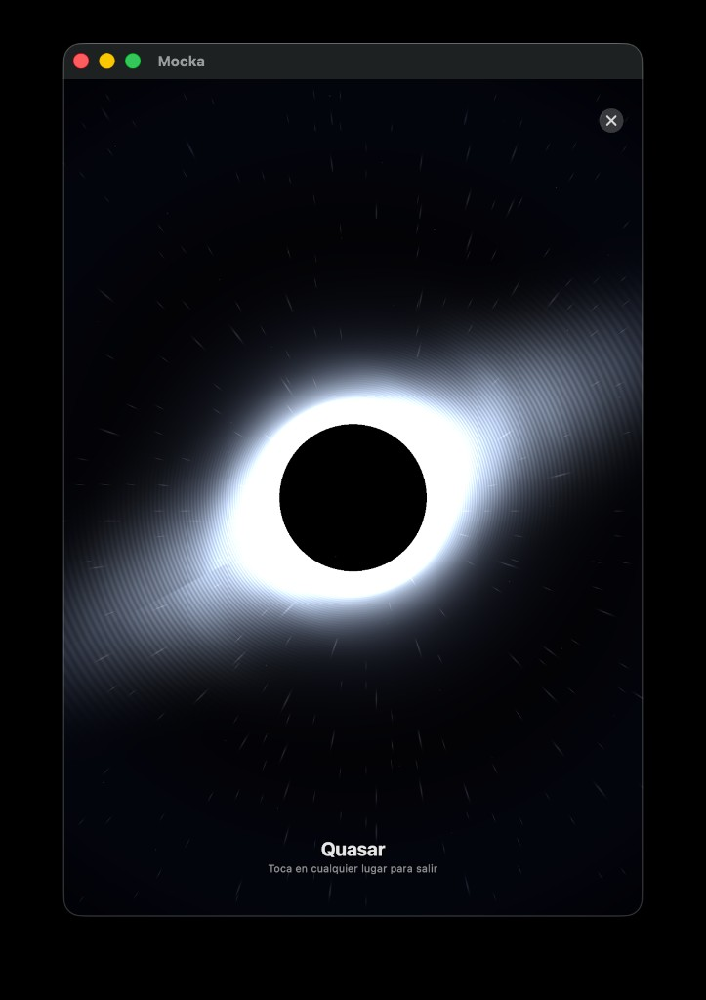
  &nbsp;
  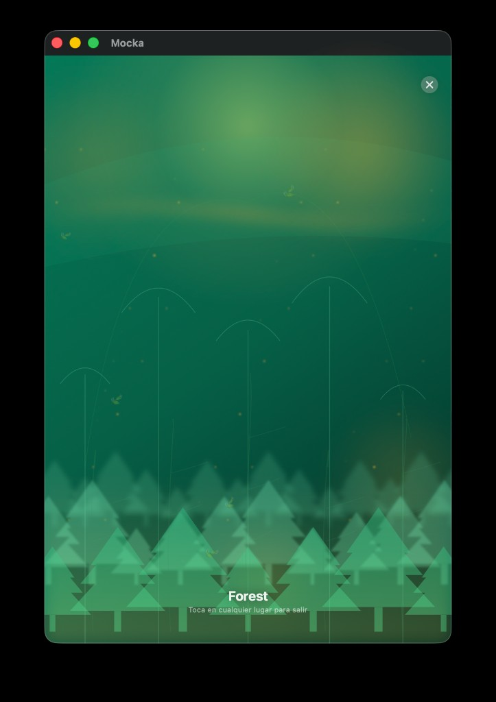
  &nbsp;
  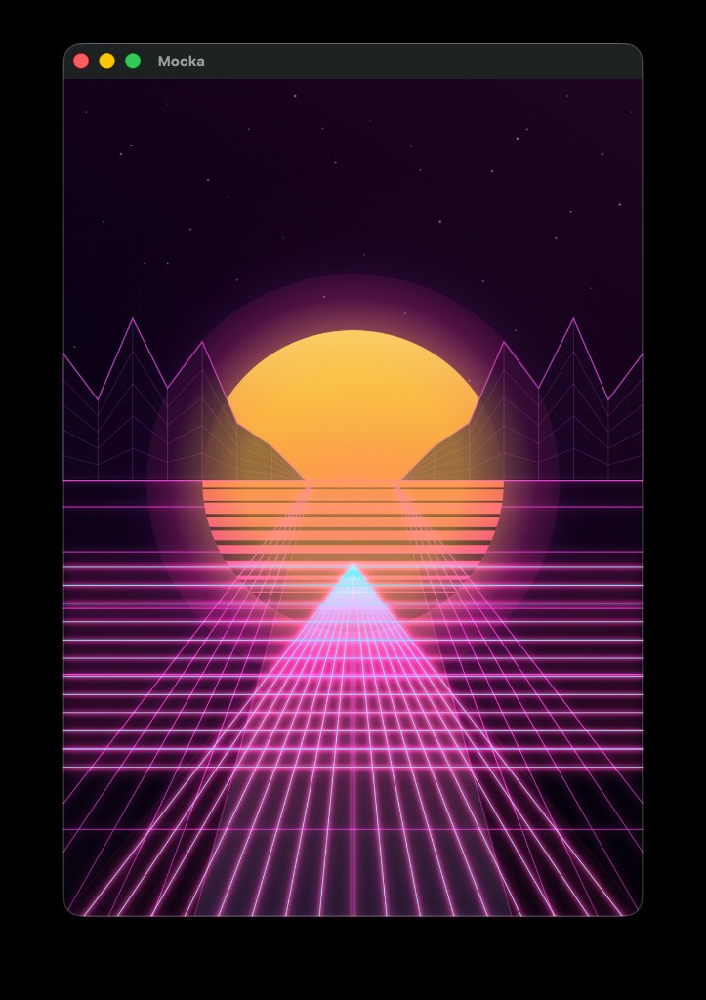

#### Widgets
Agrega widgets en la pantalla de inicio para cosas como progreso de enfoque, tareas próximas, racha de estudio y flashcards para hoy — así volver a Mocka es un toque.

#### Exportar y reconocimiento de escritura
Exporta una nota a PDF cuando necesitas compartirla o guardar una copia limpia. La escritura a mano en la pizarra se puede reconocer en el dispositivo para alimentar búsqueda y flujos de estudio sin salir del aparato en ese paso.

#### Estudio adaptativo (en progreso)
Esta es la idea grande detrás de Mocka: práctica y feedback que siguen tu ritmo. El tiempo en la app y los resultados de exámenes/repasos deberían, con el tiempo, influir en lo que se te pide después. Es parte de hacia dónde va el producto, y por qué Mocka no es solo una app de notas con un botón de quiz.

---

### En qué punto estamos
Mocka está en desarrollo activo. Las herramientas centrales de estudio — notas, pizarra, exámenes (manuales y con IA), flashcards, enfoque, tablero/tareas, búsqueda y personalización — son la base. El ciclo de feedback adaptativo es lo que estamos construyendo a continuación.

Estamos preparando una **beta en TestFlight** para que la gente pueda probar Mocka antes del lanzamiento en App Store.

---

  © Mocka · Próximamente en TestFlight

